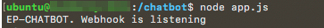
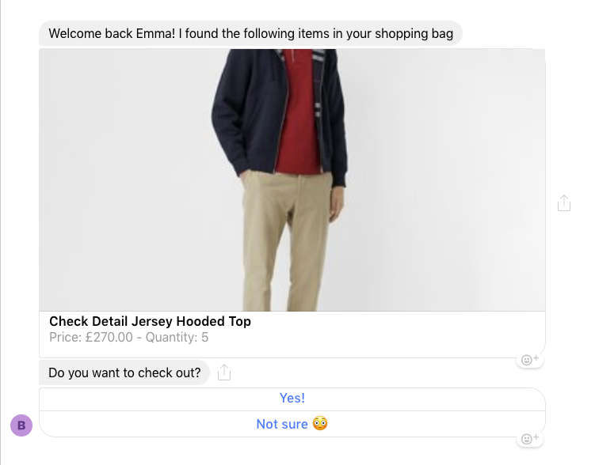
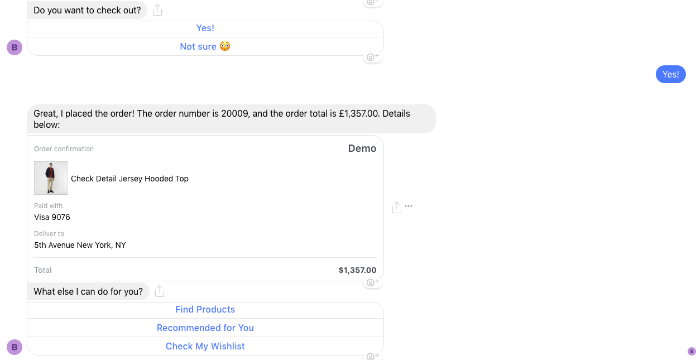
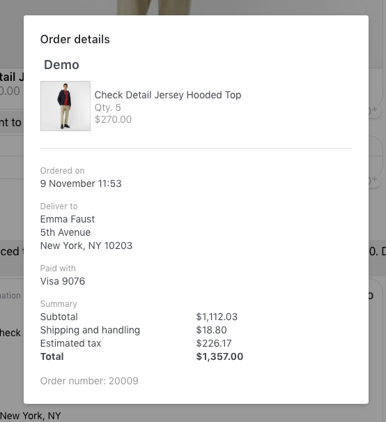

# User Guide
  
* [Code Base](#code)
* [Environment File](#environment)
* [Running the application](#running)
* [Configuring the Facebook API](#configuration)
* [Deploy the application](#deployment)
* [Making tests](#testing)
* [Appendices](#appendices)

## <a name="code">Code Base</a>

The code base is clonable from this repository: <a href="https://github.elasticpath.net/sales-demos/facebook-chatbot">Facebook Chatbot</a>.

If you plan to add features to the chatbot, then create a branch `feature/<Jira_Ticket>` where `Jira_Ticket` is the ID of the JIRA ticket you are working on. When your work is done, create a Pull Request and request reviews from <a href="http://github.elasticpath.net" target="_blank">Andres</a> or <a href="http://github.elasticpath.net/cpinelli" target="_blank">Christophe</a>.

If you are creating a chatbot for a demo, then create a branch demo/<Customer> where <Customer> is the name of the customer you are making a demo for.


## <a name="environment">Environment File</a>

The application requires some information that can be stored either in a environment file (.env) or as constants directly in the code.

.env example:
```
VERIFY_TOKEN='<Randomly_Generated_Token_To_Provide_To_Facebook>'
PAGE_ACCESS_TOKEN='<Token_Provided_By_Facebook>'

EP_SERVER='http://<Customer>.epdemos.com/cortex'
EP_SCOPE='<Customer_Store>'
EP_IMAGES='https://s3-us-west-2.amazonaws.com/ep-demo-images/<Customer>/'
```

constants example in <a href="https://github.elasticpath.net/sales-demos/facebook-chatbot/blob/master/app.js">App.js</a>
```javascript
const VERIFY_TOKEN = '<Randomly_Generated_Token_To_Provide_To_Facebook>';
const PAGE_ACCESS_TOKEN='<Token_Provided_By_Facebook>';

const EP_SERVER='http://<Customer>.epdemos.com/cortex';
const EP_SCOPE='<Customer_Store>';
const EP_IMAGES='https://s3-us-west-2.amazonaws.com/ep-demo-images/<Customer>/';
```

## <a name="running">Running the application</a>

When the development isdone, push your branch on Github, use `ssh` to connect to the VM.
From there, clone the Github repository and checkout your branch.
Run `npm install` to download the required dependencies, then run `node app.js` to run the application.
At that point, you should get the following displayed:



Use `<Ctrl>-C` to stop the application

## <a name="configuration">Configuring the Facebook API</a>

In this part, I am going to assume that you already created a Facebook business page. If you did not, please check out the appendices first.

Go to <a href="https://developers.facebook.com">Facebook for developer</a> and log in with the page admin credentials. If you have multiple pages on this account, pick the one that you are creating the chatbot for.

On the sidebar, click the (+) button next to Products, and search for `Messenger`, (it should be one of the first 3 products).
Click on Set Up to configure Messenger, In the sidebar you should now see `Messenger`.
In the page, you should see a block called `Token Generation`, select your Facebook page in this block. By doing it, Facebook will create a random token. Copy it, and populate the field `PAGE_ACCESS_TOKEN` with it, in your environment file or in your constant.
We will come back to this page when everything is set up to configure the webhooks.

At the top of the page, you should see `APP ID: <TOKEN>`. Copy `<TOKEN>` and head to your Facebook page. Hit settings on the top-right corner of the page.
On the sidebar, click Messenger Platform and scroll down to `Subscribed Apps`, this should be empty for now.
Just below this block, you can see `Link your App to Your Page`, in the field, paste the `<TOKEN>` you previously copied (i.e. APP ID) and hit `Link`
This should populate the block `Subscribed Apps` just above.

Head back to <a href="https://developers.facebook.com">Facebook for developers</a>.
On the sidebar, click Roles, this will open a dropdown menu, click Roles in this sub-menu.
You can see `Administrators` with your Facebook account and `Testers` with none in this block.
Click `Add Testers`, this will open a modal, search for your tester account and click submit.
Open a new incognito page and head to Facebook. Log in as the tester.
You should get a notification from your business page. Click accept to become a tester.

The Facebook API is now configured and the tester is able to test the chatbot.

## <a name="deployment">Deployment</a>

For the final configuration step, it is required first to deploy the application.

go to `/etc/apache2/sites-available`.
update `000-default.conf` to add this:

```
ProxyPass /chatbot http://127.0.0.1:<PORT>
ProxyPassReverse /chatbot http://127.0.0.1:<PORT>
```
where <PORT> is the port used by the node application.

Facebook will not accept not secure communication, so you need to install an SSL certificate from a valid CA.

We are going to use Let's Encrypt for this part.

run the command `sudo add-apt-repository ppa:certbot/certbot`.
Then run `sudo apt-get update`.
Run `sudo apt-get install python-certbot-apache`
Run `sudo certbot --apache -d <Customer>.epdemos.com`, where <Customer> is the subdomain that you are using.
Fulfill the form from certbot, but make sure to NOT redirect http to https by default. If you do so, it will redirect everything, including: Cortex, CM, Studio from port 80 to port 443, which will cause issues when making requests. (i.e. requests will be redirected, causing the HTTP code to be 30X instead of 20X).

You should have a new file in `/etc/apache2/sites-available`: `000-default-le-ssl.conf`.
This file contains the exact same thing as `000-default.conf` but for port 443.

Run `npm install -g forever`.
Head back to the Github repository of the chatbot and run `forever start app.js`.
This will run the Node application as a background task, so you get control again and can leave the VM without stopping the application.

Copy the content of the `VERIFY_TOKEN` constant or property, if you didn't create a token, then generate it first, try to use a 40 to 50 character long token containing only digits and capitalized letters.

Head back to <a href="https://developers.facebook.com">Facebook for developers</a>.

Click `Add subscription` or `Edit subscription` and paste the token in the `Verify Token` field.
In the callback URL field add `https://<Customer>.epdemos.com/chatbot/webhook` where `<Customer>` is the subdomain of your application.

Click `Verify and Save`. If this doesn't work, in the `Callback URL` field, there should be a red cross on the right, if you hover it you should see the cause of the error.
If you get a 404 error then it is likely that the deployment went wrong or that the application crashed.
If you get a 403 error, then you have a configuration issue in your .env file or in your constants.
To debug it, run `forever stop app.js`, then in the first method `app.get('/webhook', (req, res) => {...` add logs to check out the values of `token` that should be your `VERIFY_TOKEN` and `mode` that should be `subscribe`.


## <a name="testing">Making tests</a>

Go to Facebook and log in as the tester (i.e. the App tester).
Head to the page to test and click `Send Message` on the top on the right.

Write anything in the chat box, and the chatbot should reply with:
> Welcome back Emma! You don't have items in your shopping bag. How can I help you today?

Go to Studio and log as the tester, make sure to have all the required information set up.

Add items to your cart and go back to Facebook. Write anything in the chat box and you should see something like that:



If you click `Not Sure` the bot will put the items in your wishlist.
If you click `Yes!` the bot will pass the order:



You can then click on the order to have a new component popping up:



At this point the chatbot is up and running!


## <a name="appendices">Appendices</a>

To create a Facebook business page, log in as your page admin account.
In the sidebar, click Pages, just in the `Explore` block.
Click `Create Page` on the top right corner and click `Business or Brand`, add a page name and a category (Clothing, Brand, Computers...)
Click continue, if this is your first page, it will be asked to add a cover photo and a profile picture. Skip this part as it does not matter.


Appendices to be continued...


